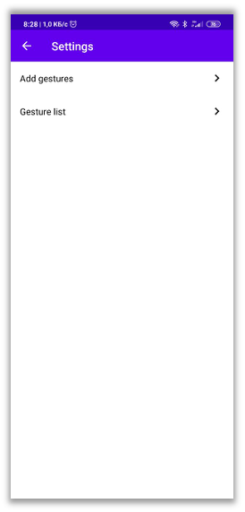

# "Watch and Do" game
## Общее описание
Данный проект был создан в качестве примера реализации программы для определения жестов пользователя, нарисованных на экране. Приложение разработано для ОС Android версии 5.0 и выше. Ниже будут рассмотрены основные теоритические сведения, нужные для реализации и понимания программной части этого проекта. Приведено общее описание структуры папок проекта для изучения кодовой базы проекта.

## Теоретическое введение
Основная задача игры – определение сходства изображений. Для выполнения этой задачи существует несколько методов, каждый из которых используется в своей области применения. В проекте рассматривались следующие алгоритмы: радиальный, габаритный, различные алгоритмы машинного обучения, определение косинусноо расстояния (используя библиотеку GestureLibrary). Проанализировав множество методов решения задачи, было принято решение остановиться на последнем.

В библиотеке Gestures Library используется алгоритм определения косинусного расстояния. Он полезен не только в области определения схожести изображения, но и в анализе текста на схожесть с другими текстовыми источниками. Сама библиотека Gestures Library достаточно легковесная. Всю информацию о “жестах” пользователя она сохраняет в текстовый файл. Там хранятся координаты нажатий пользователя в векторной форме. Для того, чтобы хранить 2 координаты используется вектор, в котором на четных позициях располагается координата X, а на нечетных – координата Y. При вводе нового эскиза со стороны пользователя библиотека переводит этот эскиз в векторную форму и вызывает функцию ‘predict’, которая находит косинусное расстояние по каждому из имеющихся в базе ‘жестов’. Эти жесты сортируются по схожести по убыванию и возвращается степень схожести в ‘score’. Эмпирическим методом можно найти оптимальный ‘score’, который будет устраивать пользователя, чтобы считать, что 2 изображения сходи.

Алгоритм косинусного расстояния, который используется внутри библиотеки Gestures Library, помогает определять схожесть изображений по начертаниям. Кроме этого, библиотека помогает определять направление жестов. То есть сохраняется последовательность точек, в которой пользователь создавал на экране эскиз. Например, горизонтальная линия справа налево и горизонтальная линия слева направо – это разные линии. Таким образом, в игре пользователь должен повторить эскиз не только по начертаниям, но и по направлению движений.

## Запуск
Для запуска проекта необходимо установить [apk-файл](https://github.com/VitalyPeryatin/WatchAndDoGame/releases/download/1.0.0/app-debug.apk) на Android устройство и запустить его после установки.

Сразу после запуска приложения откроется главный экран. На нем сверху показывается картинка, которую необходимо повторить (см. рис. 10).
Точкой помечается место, откуда нужно начинать рисовать эскиз. В случае если изображения и последовательность рисования совпадает, программа уведомляет о том, что эскизы совпадают и предлагает нарисовать новый эскиз. Сверху справа находится иконка “Шестеренка” (см. рис. 10, 11), нажав на которую откроется экран настроек. На экране настроек (см. рис. 12) есть пункты “Add gestures” (для добавления новых жестов/эскизов) и “Gesture list” (для просмотра и удаления созданных жестов). По нажатию на один из пунктов настроек открывается соответствующий экран.

На экране добавления жестов (см. рис. 13) можно добавлять новые эскизы, рисуя в светлой области экрана. Сверху располагаются иконки “Корзина” и “Дискетки” для удаления нарисованного эскиза и для сохранения текущего эскиза соответственно. При удалении эскиза холст очищается. При сохранении эскиза программа предлагает ввести имя эскиза. Ввод пустого имени не допускается. При вводе имени эскиза снизу справа находятся кнопки “Cancel”, которая закрывает диалоговое окно, и “Save”, которая сохраняет в память нарисованный эскиз и закрывает диалоговое окно.
На экране списка эскизов (см. рис. 14) можно просмотреть текущие жесты: их имена и саму картинку. Справа от каждого элемента располагается “Красная корзина”, по нажатию на которую эскиз удаляется из памяти.

## Структура папок
+ /gradle - файлы конфигурации для сборщика проекта gradle
+ /app/src/main/java/com/infinity_coder/watchanddogame - исходный код проекта
+ /app/src/main/res - ресурсы проекта
+ /images - папка с изображения для Readme.md
